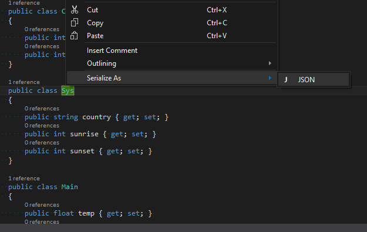
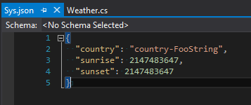

# CodeCaster.SerializeThis

## Introduction

SerializeThis is a Visual Studio Extension. It lets you generate an example JSON for a class by right-clicking a type name. This can be helpful to generate example JSON to use in unit tests or through a REST client such as [Postman](https://www.getpostman.com/).

This is not meant as a replacement for documentation and client generators such as [Swagger](http://swagger.io/).

It currently looks like this:

The serialized model looks like this:

The extension creates a temp file, writes the output there, opens the file in Visual Studio and then attempts to delete the file. 

## Feedback
Its basic functionality has been tested in various scenarios, but if you have a type it can't serialize, feel free to [open an issue](https://github.com/CodeCasterNL/CodeCaster.SerializeThis/issues)!

## Building and Running

This project is a Visual Studio Extension, so you'll need to install the [Visual Studio 2019 SDK](https://docs.microsoft.com/en-us/visualstudio/extensibility/installing-the-visual-studio-sdk?view=vs-201) in order to compile it. The startup project requres Visual Studio 2019 to open and build, but the extension will work in Visual Studio 2015, 2017 and 2019.

Start debugging by running the CodeCaster.SerializeThis project, which starts an experimental instance of Visual Studio, where the extension will be loaded. You can then open any C# file, right-click a type name and see the "Serialize As" submenu.

